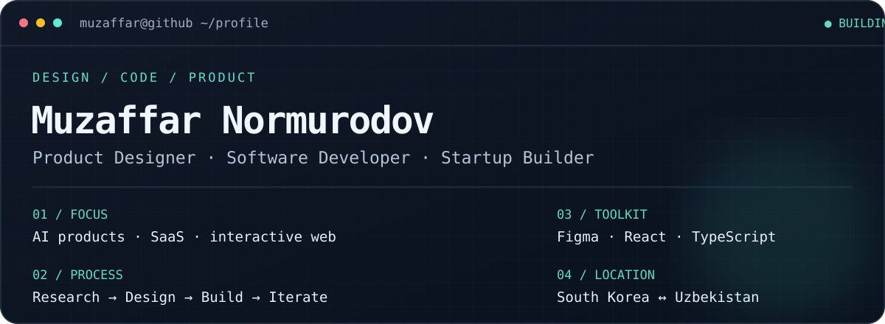

<p align="center">
  
</p>

<p align="center">
  <a href="mailto:muzaffaransoriy@gmail.com">Email</a> ·
  <a href="https://github.com/MuzaffarJr?tab=repositories">Public repositories</a>
</p>

### About

I turn ideas into usable digital products. My work connects product thinking, interface design and software development. I am exploring AI tools, startup MVPs and interactive web experiences.

```text
> whoami
  Product Designer × Software Developer × Startup Builder

> current_focus
  AI products / SaaS / 3D web interfaces

> workflow
  Research → UX → Visual design → Development → Iterate
```

### Selected work

| Project | What it explores |
| :-- | :-- |
| [Gayeongdang Hanok Stay](https://github.com/MuzaffarJr/gayeongdang-hanok-stay) · [Live demo](https://gayeongdang-hanok-demo.muzaffaransoriy.chatgpt.site) | Immersive 3D hanok hotel experience, room concepts and mobile booking inquiry |
| [Orbit Studio 3D](https://github.com/MuzaffarJr/orbit-studio-3d) | Responsive landing page concept with a CSS 3D orbital hero and pointer interaction |
| [T-Hisob](https://github.com/MuzaffarJr/T-Hisob) | AI-assisted tax workflows and clearer product experiences |
| [Creative 3D UI](https://github.com/MuzaffarJr/creative-3d-ui) | Depth, motion and interaction for the web |
| [AI UI Starter](https://github.com/MuzaffarJr/ai-ui-starter) | Reusable foundations for building AI interfaces |

Currently developing **Fabula**, a market intelligence concept, and **K-Maosh Bot**, a payroll tracking concept.

### Toolkit

| Design | Development | Product and AI |
| :-- | :-- | :-- |
| Figma · UI/UX · Design systems · Prototyping | HTML · CSS · JavaScript · TypeScript · React · Next.js | Product discovery · MVPs · AI-assisted workflows |
| Photoshop · Illustrator · Interactive UI | Tailwind CSS · Supabase · PostgreSQL · Git | OpenAI · Claude · Gemini |

### Activity

<p align="center">
  <a href="https://github.com/MuzaffarJr?tab=overview">
    
  </a>
</p>

<details>
<summary>Contribution animation</summary>

<p align="center">
  
</p>

</details>

---

<p align="center">
  <strong>Have a product idea?</strong><br>
  <a href="mailto:muzaffaransoriy@gmail.com">Let's talk about the design and build.</a>
</p>
